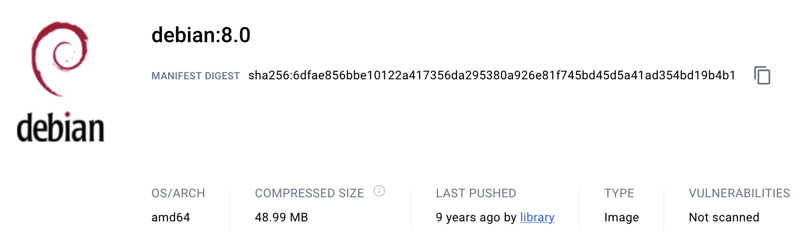
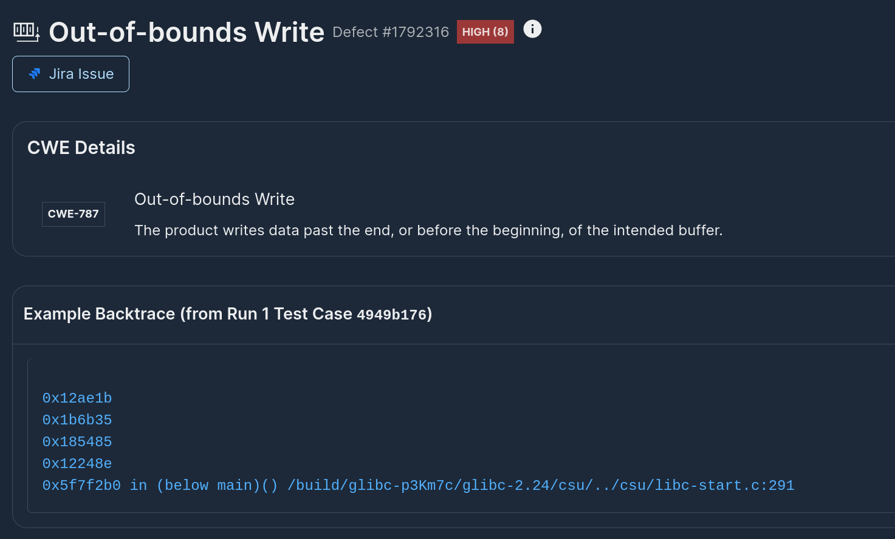

# Building a Time Machine: Testing Debian Packages Across Time

Wouldn't it be great if we could hit a button and be able to test for vulnerabilities any software package at any point in time? Besides this being an entertaining question (how vulnerable *really* was package *X* at date *Y* - using today's techniques?), it's also a very relevant problem for today's SDLC in enterprise software - not everything gets daily cloud updates, there are systems that have much longer update cycles or no updates :scream: . Knowing whether/how vulnerable we are is key! But to do that, we first need to build a mini time-machine. This is what we'll attempt here for Debian and its packages!

## Getting Started with Debian

So, how do we get started? We are looking for artifacts that allow us to fetch a version of debian from a specific point in time - the first thought that comes to mind is Dockerhub. There's already an official [Debian repository](https://hub.docker.com/_/debian) that has tons of images from the [past decade](https://hub.docker.com/layers/library/debian/8.0/images/sha256-6dfae856bbe10122a417356da295380a926e81f745bd45d5a41ad354bd19b4b1?context=explore)!



Depending on how old you want to go a quick search shows there are repositories supporting images [dating back to 2007](https://github.com/madworx/docker-debian-archive) (WARNING: for security reasons, we do not recommend running or using such old images for development)!

So are we done? Can we simply use Dockerhub to fetch a version of Debian from a point in time and test any package? The answer would be yes if these images contained all debian packages that were available at that point in time. Unfortunately, for the majority of Debian packages the answer is no :( . Worse, if we attempt to *fetch* the package using `apt update && apt install` we'll get one of two behaviors: (1) the repository referenced by that old image no longer exists (need to run with --fix-missing!), or (2) we'll install the *latest* version of that sofware package which defeats the goal of what we wanted to do with our time machine.

```sh
$ docker run -it debian:stretch
root@b396ea44812a:/# apt update --fix-missing
Ign:1 http://security.debian.org/debian-security stretch/updates InRelease
Err:2 http://security.debian.org/debian-security stretch/updates Release
  404  Not Found [IP: 151.101.194.132 80]
Ign:3 http://deb.debian.org/debian stretch InRelease
Ign:4 http://deb.debian.org/debian stretch-updates InRelease
Err:5 http://deb.debian.org/debian stretch Release
  404  Not Found
Err:6 http://deb.debian.org/debian stretch-updates Release
  404  Not Found
Reading package lists... Done
E: The repository 'http://security.debian.org/debian-security stretch/updates Release' does not have a Release file.
N: Updating from such a repository can't be done securely, and is therefore disabled by default.
N: See apt-secure(8) manpage for repository creation and user configuration details.
E: The repository 'http://deb.debian.org/debian stretch Release' does not have a Release file.
N: Updating from such a repository can't be done securely, and is therefore disabled by default.
N: See apt-secure(8) manpage for repository creation and user configuration details.
E: The repository 'http://deb.debian.org/debian stretch-updates Release' does not have a Release file.
N: Updating from such a repository can't be done securely, and is therefore disabled by default.
N: See apt-secure(8) manpage for repository creation and user configuration details.
```

All is not lost however!

## snapshot.debian.org to the rescue

Thankfully Debian is a mature and awesome Linux distribution that not only is rock-solid in terms of stability (Debian testing is an exception :P), but also has fantastic online resources. For example, Debian today maintains a snapshot service at [snapshot.debian.org](https://snapshot.debian.org/) that has precise timestamps of when packages were released with exact timestamps and contents. This snapshot service provides a valuable repository of how software packages evolved across time and also enables developers to do debugging or testing (or building a time machine like us).

We can use this exact snapshot service to fetch debian packages from any point in time for any release by setting apt sources. For example, to fetch Debian *stretch* packages from `20171101T034619Z` all we have to do is:

```sh
echo deb http://snapshot.debian.org/archive/debian/20171101T034619Z stretch main > /etc/apt/sources.list
```

and then run `apt update` and with `apt install` we can now install packages as they were in November 1st, 2017! Let's try it:

```sh
root@b396ea44812a:/# apt install nginx
Reading package lists... Done
Building dependency tree
Reading state information... Done
...
root@b396ea44812a:/# nginx -v
nginx version: nginx/1.10.3
root@b396ea44812a:/# ls -altr `which nginx`
-rwxr-xr-x 1 root root 1057840 Jul 12  2017 /usr/sbin/nginx
```

Pretty cool, huh?

## Dependency hell is real

Installing packages and managing deps is not always easy. Certain packages may have more stringent dependencies that are more complex to get working than a simple "apt install" when given a specific base image and a target date. For example, if we try installing exim in the same debian stretch container:

```sh
root@b396ea44812a:/# apt install exim4 -fy
Reading package lists... Done
Building dependency tree
Reading state information... Done
Some packages could not be installed. This may mean that you have
requested an impossible situation or if you are using the unstable
distribution that some required packages have not yet been created
or been moved out of Incoming.
The following information may help to resolve the situation:

The following packages have unmet dependencies:
 exim4 : Depends: exim4-daemon-light but it is not going to be installed or
                  exim4-daemon-heavy but it is not going to be installed or
                  exim4-daemon-custom but it is not installable
E: Unable to correct problems, you have held broken packages.
```

Now that's unfortunate, but with a bit of trial an error we found that aptitude typically succeeds much more often - especially if we tweak its ProblemResolver::SolutionCost parameter (yes, there are [many, many options](https://www.debian.org/doc/manuals/aptitude/ch02s03s04.en.html) demonstrating again that people that manage dependencies are heroes):

```sh
root@b396ea44812a:/# aptitude install exim4 -o Aptitude::ProblemResolver::SolutionCost='new'
The following NEW packages will be installed:
  bzip2{a} cron{a} exim4 exim4-base{a} exim4-config{a} exim4-daemon-light{a} file{a} guile-2.0-libs{a} krb5-locales{a} libffi6{a} libfribidi0{a} libgc1c2{a} libgmp10{a}
  libgnutls30{a} libgpm2{a} libgsasl7{a} libgssapi-krb5-2{a} libhogweed4{ab} libk5crypto3{a} libkeyutils1{a} libkrb5-3{a} libkrb5support0{a} libkyotocabinet16v5{a}
  libldap-2.4-2{a} libldap-common{a} libltdl7{a} liblzo2-2{a} libmagic-mgc{a} libmagic1{a} libmailutils5{a} libmariadbclient18{a} libncurses5{ab} libntlm0{a} libp11-kit0{a}
  libpython2.7{a} libpython2.7-minimal{a} libpython2.7-stdlib{a} libreadline7{a} libsasl2-2{a} libsasl2-modules{a} libsasl2-modules-db{a} libtasn1-6{a} libunistring0{a}
  libwrap0{a} mailutils{a} mailutils-common{a} mime-support{a} mysql-common{a} netbase{a} psmisc{a} readline-common{a} tcpd{a} xz-utils{a}
0 packages upgraded, 53 newly installed, 0 to remove and 0 not upgraded.
Need to get 16.1 MB of archives. After unpacking 59.7 MB will be used.
The following packages have unmet dependencies:
 libncurses5 : Depends: libtinfo5 (= 6.0+20161126-1+deb9u1) but 6.0+20161126-1+deb9u2 is installed
 libhogweed4 : Depends: libnettle6 (= 3.3-1+b2) but 3.3-1+deb9u1 is installed
The following actions will resolve these dependencies:

     Downgrade the following packages:
1)     libncursesw5 [6.0+20161126-1+deb9u2 (now) -> 6.0+20161126-1+deb9u1 (stable)]
2)     libnettle6 [3.3-1+deb9u1 (now) -> 3.3-1+b2 (stable)]
3)     libtinfo5 [6.0+20161126-1+deb9u2 (now) -> 6.0+20161126-1+deb9u1 (stable)]


Accept this solution? [Y/n/q/?]Y
```

We have all the basic ingredients, let's put it together in a Dockerfile and try it out.


## Building Exim Time Capsules

We put all the above in a [Dockerfile](./Dockerfile) and now we can try and see if it works with [exim](https://github.com/Exim/exim/) as our sample package. Can we build an exim time capsule - i.e., a runnable version of it from a specific point in time? Let's try it:

```sh
$ docker build -t ethan42/exim4:stretch-20171101 --build-arg RELEASE=stretch --build-arg SNAPSHOT=20171101T034619Z --build-arg PACKAGE=exim4 .
...
$ docker run -it ethan42/exim4:stretch-20171101 exim4 -bV | grep version
Exim version 4.89 #2 built 14-Jun-2017 05:03:07
```

Let's switch up the date:

```
$ docker build -t ethan42/exim4:stretch-20180101 --build-arg RELEASE=stretch --build-arg SNAPSHOT=20180101T053014Z --build-arg PACKAGE=exim4 .
...
ethan@pegasus:~/github/forallsecure/time-machine$ docker run -it ethan42/exim4:stretch-20180101 exim4 -bV | grep version
Exim version 4.89 #2 built 28-Nov-2017 21:58:00
```

Awesome! Within seconds, we got two builds of debian stretch with exim4 installed at two different points in time! Our exim time capsules are ready! Did you have a package from the past you wanted to try out? Give it a try - if it doesn't work, please let me know or file a PR and add it as an example!

## Testing our Exim Capsules with Mayhem

Now that we are able to install faithful copies of packages from any point in time, let's try to test them out! To make the example more concrete, let's see what kind of effort it would have taken to automatically detect [CVE-2018-6789](https://nvd.nist.gov/vuln/detail/CVE-2018-6789) - a high-impact exim CVE that comes with several [well-written write-ups on POCs](https://straightblast.medium.com/my-poc-walk-through-for-cve-2018-6789-2e402e4ff588).

### Configuring exim

First, let's customize our basic time-machine Dockerfile above so that we apply any configuration we need to exim before starting our testing. We have a sample under the [examples/exim4](./examples/exim4) directory where we make a few changes to get our image prepared:

1. We copy in the [configuration file](./examples/exim4/config.autogenerated) we want to test. Note that configuration can completely alter the behavior of the program and make the difference between vulnerable and non-vulnerable software (something that is typically missed by static SBOM software). This is also the case for exim and whether the developer decides to enable the "chunking_advertise_hosts" option makes all the difference. In our example, we enable it to see it in action!

```sh
# The vulnerability only works if CHUNKING is advertised during
# EHLO, so anyone trying to exploit could confirm vulnerability.
# For testing, we're going to enable it.
chunking_advertise_hosts = *
```

2. By default, exim listens over a socket at port 25 and sending packets to that port is definitely one way to test it. Luckily, the exim maintainers also allow exim to receive input from stdin - something that proves useful during exim integrations but also when trying to test it! A quick search shows that the right incantation is:

```dockerfile
CMD ["exim4", "-bs", "-v"]
```

We're now ready to run it:

```
$ docker build -t ethan42/exim4:stretch-20171101 ./examples/exim4/
...
$ docker run -it ethan42/exim4:stretch-20171101
LOG: MAIN
  Warning: No server certificate defined; will use a selfsigned one.
 Suggested action: either install a certificate or change tls_advertise_hosts option
LOG: MAIN
  Warning: purging the environment.
 Suggested action: use keep_environment.
LOG: smtp_connection MAIN
  SMTP connection from root
220 3d3bc6d2b7bd ESMTP Exim 4.89 Tue, 16 Apr 2024 18:42:55 +0000
```

We're good to go!

## Configuring Mayhem for exim

To get Mayhem testing our exim capsule, we need to write up a Mayhemfile. The fastest way to do this is by running `mayhem init`:

```
$ mayhem init ethan42/exim4:stretch-20171101
Checking if docker image exists locally
Docker image found locally
View/edit generated Mayhemfile at: /home/local/time-machine/examples/exim4/Mayhemfile
To start a run with this configuration, run  mayhem run .
```

[Mayhemfile](./examples/exim4/Mayhemfile) shows our final configuration. We made the following changes to the starting Mayhemfile:

1. We enabled [advanced_triage](https://docs.mayhem.security/code-testing/reference/support-matrix/#advanced-triage) so that Mayhem can capture even off-by-one defects that do not raise a signal that would generally go undetected. We also added `libc-dbg` to the packages our Dockerfile is installing so that advanced-triage will work (otherwise Mayhem will complain with an error message).
2. We increased the [max_length](https://docs.mayhem.security/code-testing/reference/mayhemfile/#max_length) to 75k bytes to allow Mayhem to send larger payloads (default is 8K).

Other changes that would also be helpful and improve testing performance would be to add a [dictionary](https://docs.mayhem.security/code-testing/reference/mayhemfile/#dictionary) to provide Mayhem with guidance on exim-relevant instructions (like "EHLO" etc) and a starting [testsuite](https://docs.mayhem.security/code-testing/reference/mayhemfile/#testsuite) containing valid test cases to seed our testing. However, we decided to use neither and see if Mayhem can find anything.

## Build, Push and Run

Everything is now set up, let's try testing exim! All we have to do is build, push and run against our image:

```
$ docker build -t ethan42/exim4:stretch-20171101-b ./examples/exim4/
...
$ docker push ethan42/exim4:stretch-20171101-b
...
sha256:879aecb98c92dcb5b234ae137d859f8f10e915594e73a6155a62f1af84c62b5d size: 1579
$ mayhem run --image ethan42/exim4:stretch-20171101-b ./examples/exim4/ --target stretch-20171101
Run started: exim4/stretch-20171101/1
Run URL: https://app.mayhem.security:443/ethan42/exim4/stretch-20171101/1
exim4/stretch-20171101/1
```

I started the run right before lunch and when I came back I noticed we had a finding (roughly ~50minutes after starting the run):



Is this the exploitable defect that was discovered as part of CVE-2018-6789 or did we discover something new? Is it exploitable? How would we go about checking that? We'll be looking into this in a follow up post! For the time being we'll keep using our time-machine for building more debian package capsules and testing them out :)